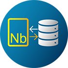

<h1 align="center">Prometheus Operator</h1>

# Prometheus Operator

The Prometheus Operator for Kubernetes provides easy monitoring definitions for Kubernetes services and deployment and management of Prometheus instances.

Once installed, the Prometheus Operator provides the following features:

- Create/Destroy: Easily launch a Prometheus instance for your Kubernetes namespace, a specific application or team easily using the Operator.

- Simple Configuration: Configure the fundamentals of Prometheus like versions, persistence, retention policies, and replicas from a native Kubernetes resource.

- Target Services via Labels: Automatically generate monitoring target configurations based on familiar Kubernetes label queries; no need to learn a Prometheus specific   
  configuration language.

# Other Supported Features

- High availability

- Multiple instances are run across failure zones and data is replicated. This keeps your monitoring available during an outage, when you need it most.

- Updates via automated operations

- New Prometheus versions are deployed using a rolling update with no downtime, making it easy to stay up to date.

- Handles the dynamic nature of containers

- Alerting rules are attached to groups of containers instead of individual instances, which is ideal for the highly dynamic nature of container deployment.

# Prometheus Operator Architecture

A high level Prometheus Operator Architecture is shown below :

# Objective of tutorial

In this tutorial,we are going to cover following topics:

1. Install Prometheus Operator and verify its successful installation.
2. Create Prometheus Instance and verify status of pods and services.
3. Monitoring a DB or any server using Prometheus and check metrics on Prometheus dashboard

